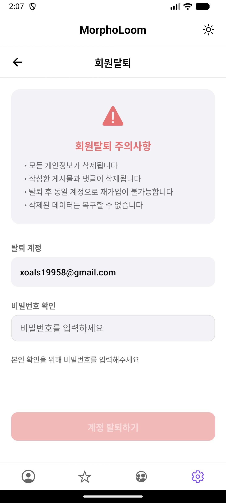
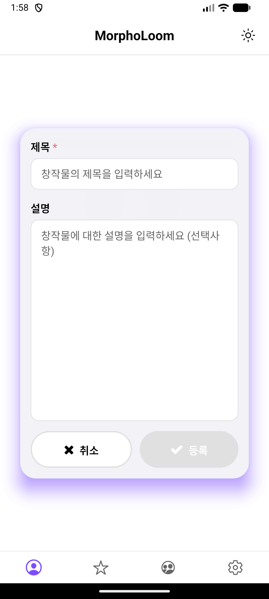
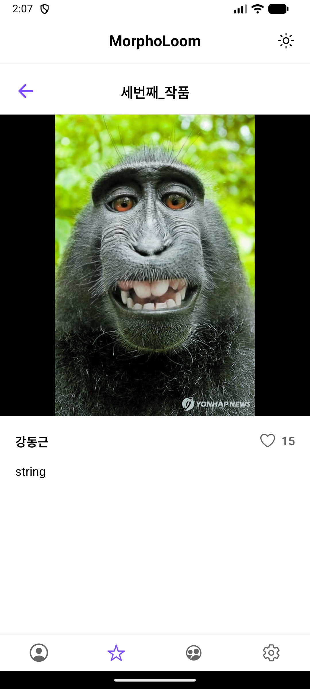
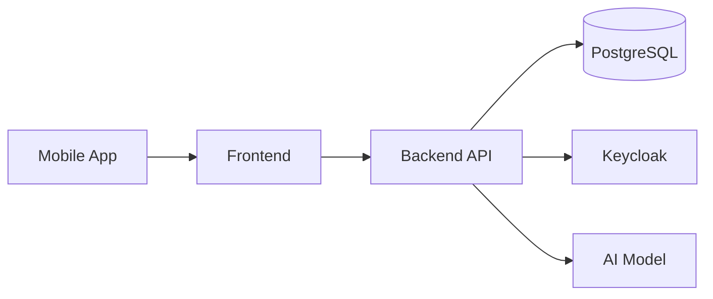

# MorphoLoom  
AI 기반 얼굴 합성 모바일 애플리케이션

---

## 서비스 소개

MorphoLoom은 사용자가 업로드한 비디오와 이미지를 기반으로  
AI 얼굴 합성을 수행하는 모바일 애플리케이션입니다.

---

## 주요 기능
### 유저 관리

  
  
  
  
  
  

  - 로그인 및 회원가입
  - 비밀번호 찾기
  - 사용자 정보
  - 회원 탈퇴

### 미디어 업로드

  
  
  

  - 비디오 업로드
  - 인물 이미지 업로드
  - 창작물 등록

### 소셜 피드

  
  
  

  - 다른 사용자 창작물 탐색
  - 좋아요(Like) 기능
  - 소셜 상세 보기 ( 좋아요 및 상세 정보 )

### 랭킹 시스템

  

  - 좋아요 기반으로 업로드한 창작물을 순위로 제공

---

## Repository 구성

- **Frontend**  
  https://github.com/MorphoLoom/MorphoLoom_ui  

- **Backend / API**  
  https://github.com/MorphoLoom/MorphoLoom  

- **AI Model (Open Source)**  
  https://github.com/KlingTeam/LivePortrait  

---

## Tech Stack

### Frontend

- **Framework**: React Native (iOS / Android 크로스 플랫폼 대응)
- **Language**: TypeScript
- **Build Tool**: Vite
- **HTTP Client**: Axios

#### State Management 전략

- **Server State**
  - React Query 사용
  - API 데이터 캐싱 및 동기화 중심 관리

- **Client State**
  - Context API 사용
  - Redux 등 별도의 전역 상태 관리 라이브러리는 미사용
  - 소규모 앱 특성을 고려한 리소스 효율적 설계

> Server State와 Client State를 명확히 구분하여 관리

---

### Backend

- **Framework**: Spring Boot
- **Language**: Java
- **API Style**: REST API
- **Authentication / Authorization**: Keycloak
- **AI 연동 방식**: Python 프로세스 기반 모델 호출
- **Job 처리**: 비동기 작업 구조

---

### Database

- **RDBMS**: PostgreSQL

---

### Infrastructure

- **Cloud**: AWS EC2 (Single Instance)
- **Containerization**: Docker

#### 배포 구성

- Backend API (Spring Boot)
- PostgreSQL
- AI Model (LivePortrait)

모든 컴포넌트를 **단일 EC2 서버 내 Docker 컨테이너**로 배포

---

### 개발 방식 및 테스트

- **개발 방법론**: Agile 기반 Sprint 방식
- **개발 기간**: 약 7일
- **개발 시간**: 1일 약 5시간

- **테스트 환경**
  - iOS / Android 에뮬레이터 기반 테스트
  - 실제 디바이스 테스트는 iOS만 진행
    - Apple Internal TestFlight 방식 활용

---

## System Architecture

## Architecture 설명

- Frontend는 UI, 사용자 입력, 상태 관리 담당
- Backend는 인증, 비즈니스 로직, AI 추론 오케스트레이션 담당
- 인증/인가 로직은 Keycloak으로 중앙 관리
- AI 모델은 Backend 내부에서만 실행
- 단일 서버 환경을 고려한 단순한 배포 구조 채택

---

## Notes

- 단기간 개발 및 빠른 검증을 목표로 한 구조
- 소규모 앱에 적합한 기술 스택 선택
- 추후 트래픽 증가 시 서버 및 모델 분리 확장 가능